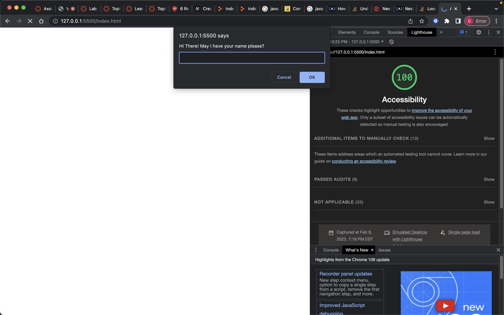

# Lab - 201-02

## About Me Project

### Author: Student/Group Name

Created By: Dasha Lewis

TA: Justin

Pair Programming:

* Driver: Emmanuel Gonzales

* Navigator: Dasha Burgos

### Links and Resources

The linked sites are what helped when creating the webpage.

[CSS](https://css-tricks.com/almanac/properties/b/background-image/)

[JavaScript Array Loops](https://stackoverflow.com/questions/36413159/understanding-nested-for-loops-in-javascript)

[JavaScript Converting String to Number](https://www.jstips.co/en/javascript/converting-to-number-fast-way/#:~:text=Converting%20strings%20to%20numbers%20is,the%20%2B%20(plus)%20operator.&text=You%20can%20also%20use%20the,number%20but%20also%20negates%20it.)

### Lighthouse Accessibility Report Score

### Reflections and Comments

This lab was challenging being such that I had issues with the order of my loops when checking the array. I would have liked to for loop o be first but I was taught by Justin that it was not possible due to the fact that the number of remaining attempts need to be checked first before the array can be looked at. It was definitely challenging but in a good way.

### Journal

### Comments

Overall the project was challenging but I know once I am able to use everything I learned instead of being restricted to use what was reviewed today. I am looking forward to seeing what else is in store for learning JavaScript. Also my CSS is forever under construction. This assignment took me about 4 hours to complete. I got done faster than I thought I would based off Lab-02.
